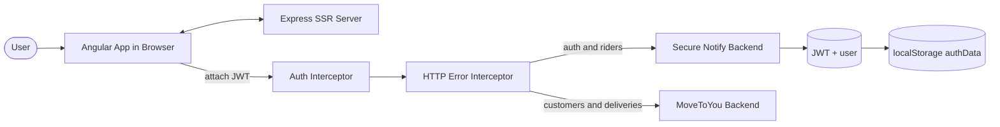

<div align="center">

# MoveToYou Frontend


**Angular 19 web frontend for managing milk and dairy delivery operations: riders, customers, and daily delivery routes.**

<!-- TODO: screenshot/GIF - capture the Home dashboard and the Daily Delivery drag-and-drop table -->

</div>

> [!NOTE]
> This is an active work in progress. The customer, rider, login, and daily delivery flows are implemented against the backend APIs. Role guards are wired up but currently commented out on the main routes, and the sidebar navigation still holds placeholder links. See the [Roadmap](#roadmap) for what is planned next.

## Table of Contents

- [About](#about)
- [Features](#features)
- [Tech Stack](#tech-stack)
- [Architecture](#architecture)
- [Getting Started](#getting-started)
- [Project Structure](#project-structure)
- [Configuration](#configuration)
- [Roadmap](#roadmap)
- [Contributing](#contributing)
- [License](#license)

## About

MoveToYou Frontend is the web client for a milk and dairy delivery management system. It gives an organization a single place to onboard delivery riders, manage their customer base, assign customers to riders, and track the daily deliveries each rider makes.

The app talks to two backends. Authentication and rider user accounts are handled by a Secure Notify backend, while customers, assignments, and delivery data come from the MoveToYou backend. Access is gated by a JWT issued at login, and the token is attached to every outgoing request by an HTTP interceptor. The app is built with server-side rendering through Angular Universal so the first page render is served from an Express server.

The real application code lives in the `mooToYouFront/` directory at the root of this branch.

## Features

- JWT login that stores auth data in the browser and decodes the token to read user role, id, and organization.
- Customer management with create, list, update, delete, and assign-to-rider flows.
- Rider management with create, list, update, and delete flows, including a reusable form base service.
- Daily delivery view for riders with a sortable, paginated table, drag-and-drop route reordering, date-range and text filtering, and bill totals.
- Role enum and a `RoleGuard` for ADMIN, USER, and RIDER access (guards are present but commented out on the current routes).
- Centralized HTTP error handling interceptor with retry, logging, and user-facing notifications.
- Auth interceptor that attaches the bearer token to requests in the browser.
- Angular Material components and Tailwind CSS for the UI, with dark-mode styling hooks.
- Server-side rendering via Angular Universal and an Express server.

## Tech Stack

| Layer | Technology |
|-------|------------|
| Framework | Angular 19 (standalone bootstrap + feature NgModules) |
| Language | TypeScript 5.5 |
| UI components | Angular Material 19, Angular CDK |
| Styling | Tailwind CSS 3.4, PostCSS, Autoprefixer |
| State / async | RxJS 7.8 |
| Auth | JWT via `jwt-decode`, HTTP interceptors |
| SSR | Angular Universal (`@angular/ssr`) + Express 4 |
| Tooling | Angular CLI, ESLint (angular-eslint), Karma + Jasmine |

## Architecture



The browser app sends API calls through two interceptors. The auth interceptor adds the bearer token, and the error interceptor retries and surfaces errors. Authentication and rider accounts go to the Secure Notify backend (`snbUrl`); customers, assignments, and deliveries go to the MoveToYou backend (`mtuUrl`).

## Getting Started

### Prerequisites

```bash
# Node.js 18+ and npm
node --version
npm --version
```

### Installation

```bash
git clone https://github.com/atiqbitstream/moveToYou-FEnd.git
cd moveToYou-FEnd/mooToYouFront
npm install
```

### Run the dev server

```bash
npm start
```

This runs `ng serve`. Open `http://localhost:4200/` in your browser. The app reloads automatically when you change source files.

### Build

```bash
npm run build
```

Build output is written to the `dist/` directory.

### Run with server-side rendering

```bash
npm run build
npm run serve:ssr:mooToYouFront
```

The SSR Express server listens on `http://localhost:4000/` (override with the `PORT` environment variable).

### Other scripts

```bash
npm test      # run unit tests with Karma + Jasmine
npm run lint  # run ESLint
npm run watch # build in watch mode (development configuration)
```

## Project Structure

```text
mooToYouFront/
  src/
    app/
      app.routes.ts              # top-level routes (login, home, riders, customers)
      app.config.ts              # providers, router, http client + interceptors
      features/
        login/                   # login form, service, request/response interfaces
        home/                    # dashboard with navigation cards
        customer/                # create, list, update, assign + customer service
        rider/                   # create, list, update, assigned customers,
                                 #   daily delivery, delivery item + rider service
        shared/
          Interceptors/          # auth + http-error interceptors
          components/layout/     # header, footer, sidebar, dialogs
          guards/                # RoleGuard
          services/              # auth, token, dialog, logger, notification
          enums/ constants/      # roles, app + message constants
          validators/ utils/     # form validators, helpers
    environments/environment.ts  # API base URLs (snbUrl, mtuUrl)
    proxy.conf.json              # /api dev proxy to localhost:3001
  server.ts                      # Express SSR entry
  angular.json                   # Angular CLI workspace config
```

## Configuration

API base URLs live in `mooToYouFront/src/environments/environment.ts`.

| Variable | Description | Default |
|----------|-------------|---------|
| `production` | Production flag for the Angular environment | `false` |
| `snbUrl` | Secure Notify backend base URL (auth + rider accounts) | `http://localhost:3000` |
| `mtuUrl` | MoveToYou backend base URL (customers + deliveries) | `http://localhost:3001` |
| `PORT` | Port for the SSR Express server (read at runtime) | `4000` |

The dev proxy in `mooToYouFront/src/proxy.conf.json` forwards `/api` to `http://localhost:3001`.

## Roadmap

- [ ] Re-enable the `RoleGuard` on the home, riders, and customers routes.
- [ ] Replace the placeholder sidebar links (Project, Analytics, Finance, Crypto) with real navigation.
- [ ] Add real screenshots or a demo GIF to this README.
- [ ] Move the test route and faker user creation behind a development-only flag.
- [ ] Integrate with DairyFarm360 and DairyShop360 (planned).
- [ ] Expand unit test coverage across feature modules.

## Contributing

Contributions are welcome. Fork the repo, create a feature branch, and open a pull request. Please run `npm run lint` and `npm test` before submitting.

## License

Distributed under the MIT License. See [LICENSE](LICENSE).
